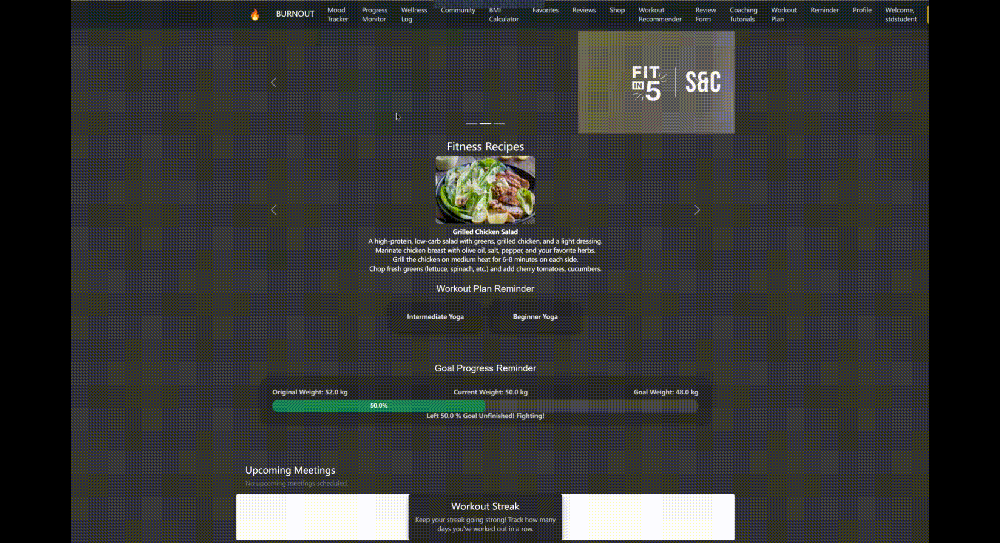

# Link to new features video:

<!--[Link](https://www.youtube.com/watch?v=2oOMdZBmv4I)-->

 
 

 

 
<!-- Open Issues -->

<!-- Closed Issues -->

<!-- Pull Requests -->

<!-- Repository Size -->

# BurnOut

# BurnOut - Your Wellness Companion

BurnOut is an easy-to-use application designed to help users manage their daily calorie intake and expenditure as well as drinking habits, and it has now been enhanced with additional features. This all-in-one wellness app is not only a user-friendly calorie tracker but also offers a comprehensive suite of tools to support individuals in achieving their fitness and weight management goals.

https://github.com/user-attachments/assets/23fbcd81-6461-4fec-9066-f7af804c861f

## What's new:

1. **Goal Setting & Reminders:** Allow users to set specific fitness goals and enable push notifications to remind them of their goals or scheduled workouts.

2. **Mood Tracker:** Include a mood tracking option so users can log how they feel before or after workouts for better self-awareness.

3. **Recipe Suggestions:** Provide a rotating selection of simple, healthy recipes or snacks within the app for users to try based on their fitness goals.

4. **Customizable Dashboard:** Let users customize their dashboard with their most-used features, like calorie tracking, hydration, workout logs etc.

## Key Features:

1. **Calorie Tracking:** BurnOut allows users to effortlessly keep track of their daily calorie intake and calories burnt through physical activities, helping them maintain a healthy lifestyle.

2. **Profile Customization:** Users can personalize their profiles by entering their height, weight, fitness goals (weight loss or gain), and target weight. This information is crucial for creating tailored fitness and dietary plans.

3. **Fitness Programs:** BurnOut offers a variety of fitness programs, including yoga classes and workout sessions, catering to users with different fitness preferences and skill levels.

4. **Social Connectivity:** The application facilitates social interaction among users. They can connect with friends by sending and accepting friend requests, enabling them to share their fitness journeys and progress, and provide support and motivation to one another.

5. **Favorite Workouts:** Users can now add their favorite workouts to a dedicated list for quick and easy access, making it convenient to stick to their preferred exercise routines.

6. **Water Intake:** Users can now record their daiy water intake to keep track of their drinking habits.

8. **Shop:** Places where user can shop for workout gears.

9. **BMI Calculator:** The newly added BMI (Body Mass Index) calculator helps users understand their current physical health status and aids in setting realistic weight management goals.

10. **Tracking User History:** BurnOut enables users to maintain a history of their fitness and dietary activities, providing insights into their progress over time and allowing for data-driven adjustments.

11. **Reviews:** Users can leave reviews and feedback on the fitness programs they've participated in, sharing their experiences with the community and helping others make informed choices.

12. **Personalized Feedback and Check-Ins:** Coaches can design tailored workout plans that align with users' goals (e.g., weight loss, strength-building) and adjust difficulty as users improve, ensuring steady progress.

13. **Detailed Instructions and Exercise Alternatives:** Users receive regular check-ins and feedback from coaches based on their performance metrics, keeping routines adaptable and responsive to user needs.

14. **Goal-Based and Progressive Plans:** Each plan includes clear exercise instructions, videos, and alternative exercises for users without specific equipment, making workouts accessible and effective.
    
16. **Progress Monitoring:** Stay motivated by tracking your fitness journey. Input your measurements daily, review your progress history, and celebrate every milestone along the way.
    
18. **Workout Streaks:** Keep the momentum going by logging your workouts each day to maintain a streak. If you miss a day, the streak resets, pushing you to stay consistent and achieve your goals.
    
20. **Personalized Workout Recommender:** Get workouts tailored specifically to you. Input your experience level, target muscles, and available equipment, and BurnOut will recommend the most effective exercises, complete with images to guide your form.
    
22. **Friends & Community Support:** Connect with friends within the app, accept friend requests, and share your daily progress to support and motivate each other in achieving your fitness goals.

This document serves as a comprehensive reference point for users, giving them insight into the functionalities of BurnOut and encouraging them to participate in its development as an open-source software project. As an open-source project, the community can contribute additional features and enhancements to make BurnOut even more robust and tailored to individual needs before its official market release. Furthermore, it assists developers by providing a clear understanding of the codebase and serves as a valuable resource for the project's continued development.

# Table of Contents

- [Link to new features video:](#link-to-new-features-video)
- [BurnOut](#burnout)
- [BurnOut - Your Wellness Companion](#burnout---your-wellness-companion)
  - [What's new:](#whats-new)
  - [Key Features:](#key-features)
- [Table of Contents](#table-of-contents)
- [Why use BurnOut?](#why-use-burnout)
- [TechStack Used for the Development of Project](#techstack-used-for-the-development-of-project)
- [New features added](#new-features-added)
- [Core Functionalities of the Application](#core-functionalities-of-the-application)
  - [Login](#login)
  - [Dashboard](#dashboard)
  - [Exercise Section](#exercise-section)
  - [Enter Calories](#enter-calories)
  - [Enter Water Intakes](#enter-water-intakes)
  - [View User Profile](#view-user-profile)
  - [Progress Monitor](#progress-monitor)
  - [Wellness Log](#wellness-log)
  - [Workout Streak](#workout-streak)
  - [Workout recommender](#workout-recommender)
  - [Community](#community)
  - [Signup As Coach](#signup-as-coach)
  - [Get Personalized Workouts](#get-personalized-workouts)
  - [Track Student Progress](#track-student-progress)
  - [Goal Setting \& Reminders](#goal-setting--reminders)
  - [Mood Tracker](#mood-tracker)
  - [Recipe Suggestions](#recipe-suggestions)
  - [Customizable Dashboard](#customizable-dashboard)
- [Steps for execution](#steps-for-execution)
- [Source Code](#source-code)
- [Future Scope](#future-scope)
- [Team Members](#team-members)
- [Contribution](#contribution)
- [License](#license)

# Why use BurnOut?

- User can keep a track of their calorie intake and drinking habits.
- User just needs to input the food they've had, calories get calculated automatically.
- Displays a record of calories in and calories burnt out day wise in History tab.
- Users can connect with their friends and keep track of each other's progress.
- Provide users with places to shop workout gears.
- Enrollment into numerous yoga and workout sessions.
- Daily automated reminders for working out and exercising.
- Accessible to everyone and easy to use.
- Register as a coach and guide students.
- Get personalized workouts and diet plan from coaches.

# TechStack Used for the Development of Project

 Python  
 MongoDB  
 CSS3  
 HTML 5  

# New features added #

# Core Functionalities of the Application

## Login

## Dashboard

## Exercise Section

## Enter Calories

## Enter Water Intakes

## View User Profile

## Progress Monitor

## Wellness Log

## Workout Streak

## Workout recommender

## Community

## Signup As Coach

## Get Personalized Workouts

## Track Student Progress

## Goal Setting & Reminders

## Mood Tracker

## Recipe Suggestions

## Customizable Dashboard

# Steps for execution

Step 1:
Install MongoDB using the following link:

Windows:
https://docs.mongodb.com/manual/tutorial/install-mongodb-on-windows

MacOS:
https://www.mongodb.com/docs/manual/tutorial/install-mongodb-on-os-x/

Step 2:
Git Clone the Repository

    git clone https://github.com/vegechick510/FitnessAppXXX.git

(OR) Download the .zip file on your local machine

    https://github.com/vegechick510/FitnessAppXXX.git

Step 3:
Install the required packages by running the following command in the terminal

    pip install -r requirements.txt

Step 4:
Run the following command in the terminal

    python application.py

Step 5:
Open the URL in your browser:  
 http://127.0.0.1:5000/

NOTE!!:
If you get error regarding any of the following packages - pymongo and bson, then dont worry we have also been there. Run the following commands to resolve the error :

    pip uninstall bson
    pip uninstall pymongo
    pip install pymongo

# Source Code

Link to the repository:
https://github.com/vegechick510/FitnessAppXXX

# Future Scope

**Delete Data:** Enables users to delete records like workout logs, mood entries, or food data, helping manage data effectively while maintaining privacy and control.

**Multiple Goal Reminders:** Allows users to set multiple fitness goals and reminders, supporting specific objectives like targeting muscle groups or achieving milestones, encouraging a diverse fitness journey.

**AI-Powered Recommendations:** Uses AI to suggest personalized workout plans, recipes, or reminders based on user habits and preferences, tailoring guidance to energy levels and goals.

**Search and Filter:** Adds search and filter options to exercise and recipe databases, helping users quickly find workouts or meals based on categories like difficulty, duration, or dietary needs.

# Team Members
- [@Xianting Lu](https://github.com/xiantinglu)
- [@Xiang Lan](https://github.com/xianglan010)
- [@Xingyue Shi](https://github.com/AMShek)

# Contribution

Please refer the [CONTRIBUTING.md](https://github.com/vegechick510/FitnessAppXXX/blob/main/CONTRIBUTING.md) file for instructions on how to contribute to our repository.
<a href="https://github.com/vegechick510/FitnessAppXXX/issues/new/choose">Report Bug</a>
<a href="https://github.com/vegechick510/FitnessAppXXX/issues/new/choose">Request Feature</a>

# License

This project is licensed under the MIT License.
